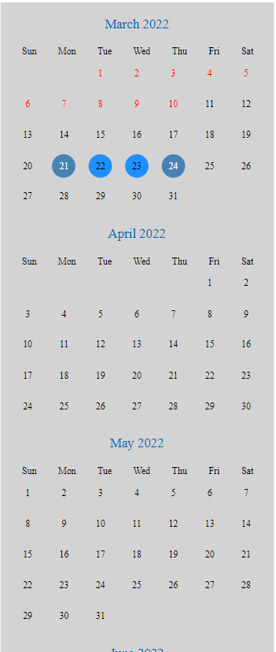
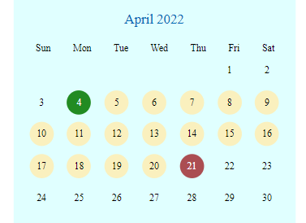
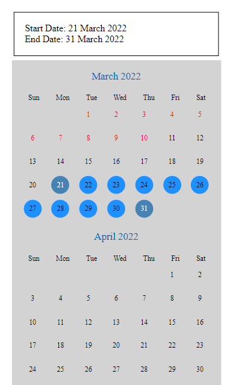

# date-range-calendar

> A calendar and date/date-range picker for react.

- [Dependencies](#dependencies)
- [Setup](#setup)
- [Options](#options)

## Dependencies

- dayjs
- styled-components

## Setup

`npm i date-range-calendar`

## Code Examples

Default calendar with no props:


```
import { Calendar } from 'date-range-calendar';

function App() {
  return (
    <Calendar />
  );
}
export default App;
```

Pass props to customize colors:


```
import { Calendar } from 'date-range-calendar';

function App() {
  return (
    <Calendar
      bgColor='#e0ffff'
      startBgColor='#228b22'
      endBgColor='#ab4e52'
      rangeColor='#faf0be'
    />
  );
}
export default App;
```

Pass set functions to receive start and end date values:


```
import React, { useState } from 'react';
import { Calendar } from 'date-range-calendar';

function App() {
  const [startDate, startDateSet] = useState('');
  const [endDate, endDateSet] = useState('');

  return (
    <div style={{padding: '2%'}}>

      <div style={{border: '1px solid black', padding: '5%', margin: '2%'}}>
        <div>Start Date: {startDate}</div>
        <div>End Date: {endDate}</div>
      </div>
    <div>
            <Calendar

        startSet={startDateSet}
        endSet={endDateSet}
        />
    </div>
        </div>
  );
}
export default App;
```

## Options

  <p>
    <b>begin:</b> string in format mmyyyy(082020 for august 2020) <br>
    &nbsp;&nbsp;default is current month of current year
     </p>

  <p> <b>calendarLength:</b> number in months<br>
    &nbsp;&nbsp;default is 24 months
  </p>
  <p> <b>rangeLimit:</b> number in days<br>
    &nbsp;&nbsp;default is 30 days</p>
  <p> <b>bgColor:</b> string <br>
  &nbsp;&nbsp; default is gray</p>
  <p> <b>startBgColor:</b> string <br>
  &nbsp;&nbsp;default is steelblue</p>
  <p> <b>endBgColor:</b> string <br>
  &nbsp;&nbsp;default is steelblue</p>
  <p> <b>rangeColor:</b> string <br>
   &nbsp;&nbsp;default is dodgerblue</p>
  <p> <b>startSet, endSet:</b> (end: string) => void <br>
  &nbsp;&nbsp;you need to pass a set function as a prop in order to get the start/end values.  Format will be 'dd Month Year' (01 April 2022) See the example above</p>
  <p> <b>blackoutColor:</b> string   <br>
    &nbsp;&nbsp;default is red</p>
  <p> <b>textColor:</b> string <br>
   &nbsp;&nbsp; affects dayNames, non selected non blackout numbers NOT MONTHS. Default is black.</p>
  <p> <b>monthColor:</b> string 
   &nbsp;&nbsp;change the color of the names of the months. Default is #0067B4</p>
  <p> <b>highlightedTextColor:</b> string //complete</p>
  <p> <b>blackoutPast:</b> boolean // option to turn it off only works if custom begin not selected</p>
